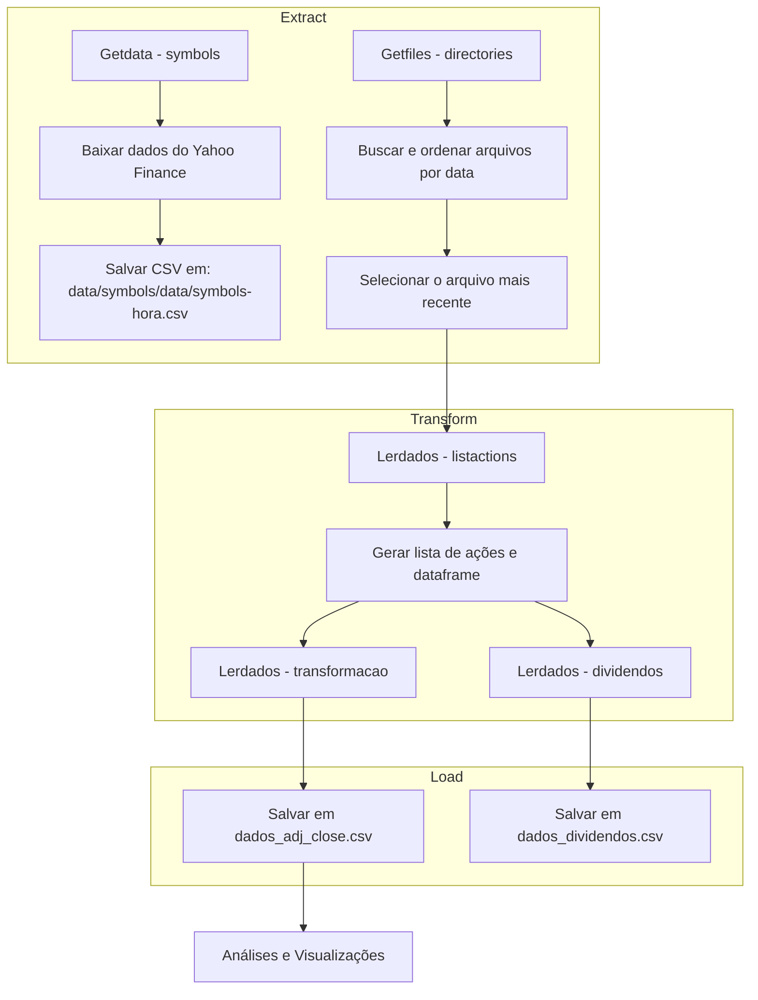

### Resumo
Esse projeto tem como objetivo usar o framework flask para analise de dadoos e criação de dashboards,
para isso será adotado o conceito fundamental ETL para construir um banco de dados relacional.
Será criado através da linguagem de programação Python o processos de Extração, Tratamento e Limpeza dos dados.

### Preparação do ambiente de desenvolvimento:

**Para criação do ambiente**:
    ``python3 -m venv ./env``

**Para ativar o ambiente**:
    ``source ./env/bin/activate``

**Instalação do FrameWork (Flask)**:
    ``pip install Flask``

**Verificar a versão da instalação:**
    ``python -m flask --version``

**Salva todos os pacotes no ambiente**
    ``pip freeze > requirements.txt``

**Para rodar a aplicação**
    ``python app.py``


### Integração de Classe em Flask

Para criar um projeto Flask usando a estrutura Model-View-Template (MVT), siga os passos abaixo. A estrutura MVT no Flask é semelhante ao padrão MVC (Model-View-Controller), onde:

**Model:** Representa a camada de dados, interagindo com o banco de dados, mas para esse projeto estou usando aquivo em formato CSV
**View:** Representa o que o usuário vê. No Flask, as views são compostas por templates HTML.
**Template:** São arquivos HTML que podem conter placeholders para serem preenchidos dinamicamente.

### 1. Estrutura do Projeto

```
anasises_de_dados/
├── app.py                                              # Arquivo principal para iniciar a aplicação Flask
├── data                                                # Arquivos para análise
│   ├── dados_dividendos.csv
│   └── symbols
│       ├── 02-04-2025
│       │   └── symbols-20_13_58.csv
│       └── 23-03-2025
│           └── symbols-21_22_29.csv
├── models
│   ├── read_data.py                                    # Lógica para ler dados do CSV e transformá-los
│   ├── scandir.py                                      # Lógica para buscar dados usando a lista de ações
│   └── search.py                                       # Lógica para escanear diretórios e encontrar arquivos CSV
├── README.md                                           # Documentação do projeto
├── requirements.txt                                    # Bibliotecas
├── static
│   ├── css
│   │   ├── sb-admin-2.css
│   │   └── sb-admin-2.min.css
│   ├── favicon
│   │   ├── icons8-analytics-16.png
│   │   ├── icons8-financial-analytics-16.png
│   │   └── icons8-web-analytics-16.png
│   ├── image
│   │   ├── 10806755_4575463.jpg
│   │   └── 72836188_2308-w018-n002-2119B-p15-2119.jpg
│   └── style.css
└── templates                                          # Arquivos HTML para as views
    ├── base.html                                      # Template modelo
    ├── dashboard.html                                 # Página para exibir gráficos dos dados
    ├── index.html                                     # Página de lista de ações
    └── transform.html                                 # Página para exibir transformação dos dados  

```




### 2. models
    Contém a lógica para carregar e manipular dados a partir de um arquivo CSV.

#### 2.1 Arquivo models/read_data.py
    Este arquivo é responsável por carregar e transformar dados dos arquivos CSV:

#### 2.2 Arquivo models/shearch.py
    Este arquivo é responsável por buscar dados de ações através da API Yahoo Finance e salvar em CSV:

#### 2.3 Arquivo models/read_data.py
    Este arquivo é responsável por listar arquivos CSV encontrados em subdiretórios de um caminho especificado. Aqui está uma explicação detalhada do código

### 3. Arquivo app.py
    Este arquivo será o principal da aplicação Flask e importará a classes Getdata e Lerdados:
    
```
    from flask import Flask, render_template
    from models.shearch import Getdata
    from models.read_data import Lerdados
```


### 4. Templates
    São arquivos HTML em templates/ que mostram os dados para o usuário.
#### 4.1 Arquivo index.html
    Template destinado a dataviz:

#### 4.2 Arquivo transform.html
    Template destinado a descrição de dados e tabelas:


#### 5. Arquivo de Estilos (static/style.css)
    Se você quiser adicionar um arquivo de estilos CSS e customizações.

