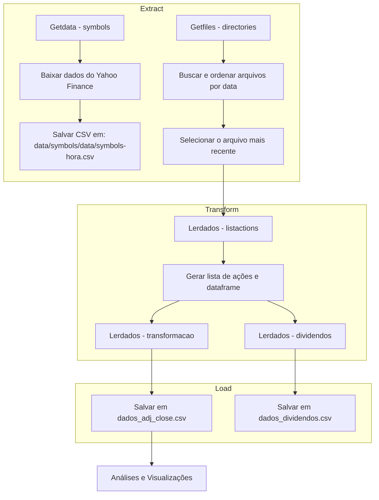

### Resumo
Esse projeto tem como objetivo usar o framework flask para analise de dadoos e criação de dashboards,
para isso será adotado o conceito fundamental ETL para construir um banco de dados relacional.
Será criado através da linguagem de programação Python o processos de Extração, Tratamento e Limpeza dos dados.

### Preparação do ambiente de desenvolvimento:

**Para criação do ambiente**:
    ``python3 -m venv ./env``

**Para ativar o ambiente**:
    ``source ./env/bin/activate``

**Instalação do FrameWork (Flask)**:
    ``pip install Flask``

**Verificar a versão da instalação:**
    ``python -m flask --version``

**Salva todos os pacotes no ambiente**
    ``pip freeze > requirements.txt``

**Para rodar a aplicação**
    ``python app.py``


### Integração de Classe em Flask

Para criar um projeto Flask usando a estrutura Model-View-Template (MVT), siga os passos abaixo. A estrutura MVT no Flask é semelhante ao padrão MVC (Model-View-Controller), onde:

**Model:** Representa a camada de dados, interagindo com o banco de dados, mas para esse projeto estou usando aquivo em formato CSV
**View:** Representa o que o usuário vê. No Flask, as views são compostas por templates HTML.
**Template:** São arquivos HTML que podem conter placeholders para serem preenchidos dinamicamente.

### 1. Estrutura do Projeto

```
projeto_flask_data/
├── app/                        # Núcleo da Aplicação Flask
│   ├── __init__.py             # Inicializa o App e extensões (SQLAlchemy)
│   ├── controllers/            # Rotas e lógica de entrada/saída
│   │   └── data_controller.py  # Onde você dispara os jobs do Dagster
│   ├── models/                 # Modelos do SQLAlchemy (Tabelas do App)
│   ├── services/               # Camada de Integração (Onde fica a lógica Dagster/dbt)
│   │   └── dagster_service.py  # Funções que chamam a API do Dagster
│   ├── static/                 # CSS, JS, Imagens
│   └── templates/              # Visões (HTML com Jinja2)
│
├── data_pipeline/              # Onde vive a "Engenharia de Dados"
│   ├── dagster/                # Definições de Assets e Ops do Dagster
│   └── dbt_project/            # Seu projeto dbt completo
│       ├── models/             # Transformações SQL do dbt
│       └── dbt_project.yml
│
├── tests/                      # Testes unitários e de integração
├── config.py                   # Variáveis de ambiente e chaves de API
├── requirements.txt            # Dependências Python
└── run.py                      # Ponto de entrada para rodar o Flask
  

```


```mermaid
graph TD;

    subgraph Extract
        A1[Getdata - symbols] --> A2[Baixar dados do Yahoo Finance]
        A2 --> A3[Salvar CSV em: data/symbols/data/symbols-hora.csv]
        A4[Getfiles - directories] --> A5[Buscar e ordenar arquivos por data]
        A5 --> A6[Selecionar o arquivo mais recente]
    end

    subgraph Transform
        A6 --> B1[Lerdados - listactions]
        B1 --> B2[Gerar lista de ações e dataframe]

        B2 --> C1[Lerdados - transformacao]
        B2 --> C2[Lerdados - dividendos]
    end

    subgraph Load
        C1 --> D1[Salvar em dados_adj_close.csv]
        C2 --> D2[Salvar em dados_dividendos.csv]
    end

    D1 --> E[Análises e Visualizações]

```


### 2. models
    Contém a lógica para carregar e manipular dados a partir de um arquivo CSV.

#### 2.1 Arquivo models/read_data.py
    Este arquivo é responsável por carregar e transformar dados dos arquivos CSV:

#### 2.2 Arquivo models/shearch.py
    Este arquivo é responsável por buscar dados de ações através da API Yahoo Finance e salvar em CSV:

#### 2.3 Arquivo models/read_data.py
    Este arquivo é responsável por listar arquivos CSV encontrados em subdiretórios de um caminho especificado. Aqui está uma explicação detalhada do código

### 3. Arquivo app.py
    Este arquivo será o principal da aplicação Flask e importará a classes Getdata e Lerdados:
    
```
    from flask import Flask, render_template
    from models.shearch import Getdata
    from models.read_data import Lerdados
```


### 4. Templates
    São arquivos HTML em templates/ que mostram os dados para o usuário.
#### 4.1 Arquivo index.html
    Template destinado a dataviz:

#### 4.2 Arquivo transform.html
    Template destinado a descrição de dados e tabelas:


#### 5. Arquivo de Estilos (static/style.css)
    Se você quiser adicionar um arquivo de estilos CSS e customizações.

